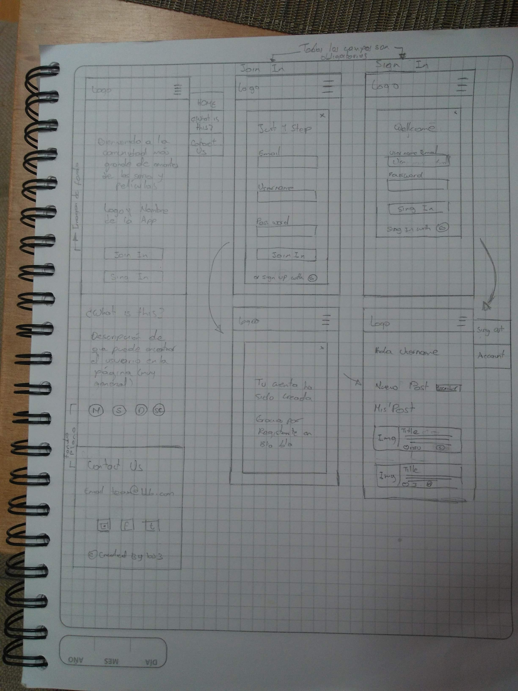

# Creando una Red Social

## HELIVISUEL

## Índice

* [1. Definición del producto](#1-definición-del-producto)
* [2. Historia de usuarios](#2-historia-de-usuarios)
* [3. Prototipos](#3-prototipos)
* [4. Test de usabilidad](#4-Test-de-usabilidad)
* [5. Objetivos de aprendizaje](#5-objetivos-de-aprendizaje)
* [6. Objetivos de aprendizaje](#6-autores)

## 1. DEFINICIÓN DEL PRODUCTO

Definición del problema

Con las mejoras en el flujo de datos a partir de tecnologías como 4G y 5G, el crecimiento de contenido audiovisual variado, de calidad y asequible a través de plataformas de streaming, se están creando comunidades de discusión sobre series, películas, documentales, cortometrajes, etc., donde las opiniones generan un valor sobre cada contenido para el usuario influenciado las decisiones sobre lo próximo que verá y al tiempo le permite compartir con personas que tienen intereses afines.

Perfil del usuario

Nuestros usuarios son personas entre los 18 y los 50 años tiene un interés por las películas, series y demás contenido audiovisual, que tienen acceso a las plataformas de streaming como Netflix, Disney +, Amazon Prime o Hulu o servicios de televisión o que frecuentan el cine, y a quiénes les gusta compartir y comparar opiniones sobre estas producciones.

Nuestros usuarios abarcan desde aquel que se dedica profesionalmente a hacer reviews hasta personas que solo buscan aportar su opinión o una buena recomendación. Quieren poder agregar recomendaciones de otros a su lista de pendientes, y agregar una lista donde aparezca aquello que vio y quiere recomendar a la comunidad o comentar, participar en discusiones, poder buscar una película por su título ver las reviews asociadas y darles like, saber quién escribió la reseña (y si le gusta poder seguirlo).

## 2. HISTORIAS DE USUARIO

*  H1: El usuario se puede loguear o registrar
*  H2: El usuario puede realizar posts y visualizarlos en su muro
*  H3: El usuario podrá ingresar a su perfil y ver su información general
*  H4: El usuario tendrá más opciones para interactuar en la red social

## 3. PROTOTIPOS DE ALTA Y BAJA FIDELIDAD

Prototipos de baja fidelidad

Prototipos de alta fidelidad

Movil: [Figma Mobile](https://www.figma.com/proto/vVV1qI2KgMuUCAKSVx8nxJ/Prototyping-in-Figma?node-id=31%3A492&scaling=scale-down)

Desktop: [Figma Desktop](https://www.figma.com/proto/vVV1qI2KgMuUCAKSVx8nxJ/Prototyping-in-Figma?node-id=51%3A79&scaling=min-zoom)

Tablet: [Figma Tablet](https://www.figma.com/proto/vVV1qI2KgMuUCAKSVx8nxJ/Prototyping-in-Figma?node-id=77%3A180&scaling=scale-down)

Paleta de colores

Herramientas de apoyo

[Figma](https://www.figma.com/) - Prototipado
[Flaticon](https://www.flaticon.com/) - Iconos
[Unsplash](https://unsplash.com/) - Imágenes
[Content Reel](https://contentreel.design/) - Avatar

## 4. TEST DE USABILIDAD

En los tests de usabilidad que se realizaron con nuestras compañeras y coach se identifico que la paleta de colores que estabamos utilizando era la correcta, les gusto el diseño de la página, como sugerencias nos dijeron que pusieramos la letra mas grande, adicional que le cambiaramos el color si era un link, y que el fondo del timeline fuera diferente al tono blanco para que la experiencia visual del usuario fuera mejor.
El usuario interactua con la pagina de la siguiente manera:
1. Primero el usuario entra a una pagina de Bienvenida a la red social donde puede ingresar.
2. Segundo encuentra una sección donde se puede loguear, tiene la opción de crear una cuenta o entrar con Google, adicional tiene la opción de recuperar la contraseña si la ha olvidado.
3. Tercero al haberse logueado ya puede ingresar al timeline, donde puede realizar una publicación teniendo en cuenta tres categorias: Películas, series o documentales. Además puede dar o quitar like a otras publicaciones.
4. Cuarto tiene una sección de perfil, donde puede cambiar su foto, agregar una biografia, y ver sus publicaciones, las cuales puede editar o eliminar.

## 5. OBJETIVOS DE APRENDIZAJE

### HTML y CSS

* [x] [Uso de HTML semántico.](https://developer.mozilla.org/en-US/docs/Glossary/Semantics#Semantics_in_HTML)
* [x] Uso de selectores de CSS.
* [x] Construir tu aplicación respetando el diseño realizado (maquetación).
* [x] [Uso de flexbox en CSS.](https://css-tricks.com/snippets/css/a-guide-to-flexbox/)

### DOM y Web APIs

* [x] Uso de selectores del DOM.
* [x] Manejo de eventos del DOM.
* [x] [Manipulación dinámica del DOM.](https://developer.mozilla.org/es/docs/Referencia_DOM_de_Gecko/Introducci%C3%B3n)
(appendChild |createElement | createTextNode| innerHTML | textContent | etc.)
* [ ] [History API.](https://developer.mozilla.org/es/docs/DOM/Manipulando_el_historial_del_navegador)
* [ ] [localStorage.](https://developer.mozilla.org/es/docs/Web/API/Window/localStorage)

### JavaScript

* [x] Uso de condicionales (if-else | switch | operador ternario)
* [x] Uso de funciones (parámetros | argumentos | valor de retorno)
* [x] Manipular arrays (filter | map | sort | reduce)
* [ ] Manipular objects (key | value)
* [x] Uso ES modules ([`import`](https://developer.mozilla.org/en-US/docs/Web/JavaScript/Reference/Statements/import)
| [`export`](https://developer.mozilla.org/en-US/docs/Web/JavaScript/Reference/Statements/export))
* [x] Diferenciar entre expression y statements.
* [x] Diferenciar entre tipos de datos primitivos y no primitivos.
* [x] [Uso de callbacks.](https://developer.mozilla.org/es/docs/Glossary/Callback_function)
* [x] [Consumo de Promesas.](https://scotch.io/tutorials/javascript-promises-for-dummies#toc-consuming-promises)

### Testing

* [ ] [Testeo unitario.](https://jestjs.io/docs/es-ES/getting-started)
* [ ] [Testeo asíncrono.](https://jestjs.io/docs/es-ES/asynchronous)
* [ ] [Uso de librerias de Mock.](https://jestjs.io/docs/es-ES/manual-mocks)

### Estructura del código y guía de estilo

* [x] Organizar y dividir el código en módulos (Modularización)
* [x] Uso de identificadores descriptivos (Nomenclatura | Semántica)
* [x] Uso de linter (ESLINT)

### Git y Github

* [x] Uso de comandos de git (add | commit | pull | status | push)
* [x] Manejo de repositorios de GitHub (clone | fork | gh-pages)
* [x] Colaboración en Github (branches | pull requests | |tags)
* [ ] Organización en Github (projects | issues | labels | milestones)

### Firebase

* [x] [Firestore.](https://firebase.google.com/docs/firestore)
* [x] [Firebase Auth.](https://firebase.google.com/docs/auth/web/start)
* [ ] [Firebase security rules.](https://firebase.google.com/docs/rules)
* [x] Observadores. ([onAuthStateChanged](https://firebase.google.com/docs/auth/web/manage-users?hl=es#get_the_currently_signed-in_user)
 | [onSnapshot](https://firebase.google.com/docs/firestore/query-data/listen#listen_to_multiple_documents_in_a_collection))

### UX

* [x] Diseñar la aplicación pensando y entendiendo al usuario.
* [x] Crear prototipos para obtener feedback e iterar.
* [x] Aplicar los principios de diseño visual (contraste, alineación, jerarquía)
* [x] Planear y ejecutar tests de usabilidad.

## 6. AUTORES

Daniela Romero Vera [@DanielaRomeroV](https://github.com/DanielaRomeroV)

Clara Escobar Sarmiento [@Claraescobar123](https://github.com/Claraescobar123)

Diana Catalina Olarte [@dcoa](https://github.com/dcoa)
